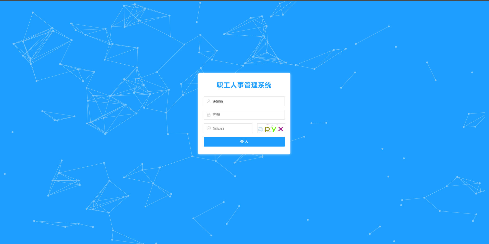
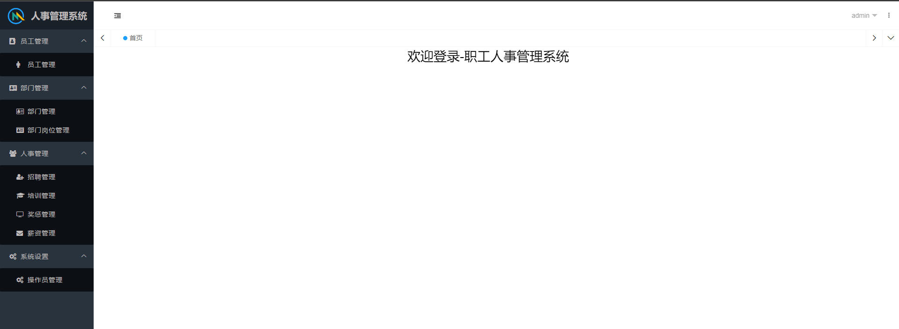
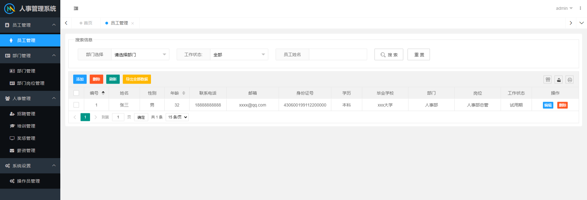
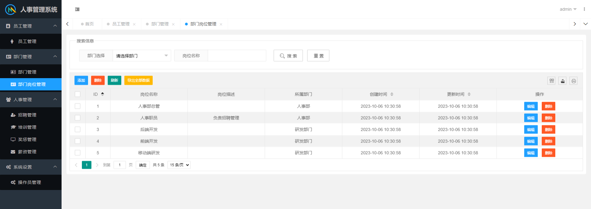

**完整代码收费 +   316595344     或    lz316595344  咨询** 

**接毕业设计和论文**

**如果图片加载不出来可以去博客看 https://blog.csdn.net/qq_56450993/article/details/133606379**

**毕业设计所有选题地址**

**[github]👉https://github.com/XinChennn/allProjects**

**[gitee]👉https://gitee.com/xinchennn/allProjects**

**[忻辰的个人博客]👉https://www.ixinjiu.cn/articles/156**

# 人事管理系统

## 一、系统介绍
本系统为职工人事管理系统，系统分为七大模块：职工管理，部门管理，岗位管理，招聘管理，奖惩管理，薪资管理，培训管理

系统默认有两个个角色：管理员，普通用户

- 管理员（admin/admin123）：可以操作所有功能、增加用户
- 普通用户（test/test）：只可查看记录、无法修改

## 二、主要技术
Springboot+MyBatis+MySQL+Layui-mini后台框架
使用Shiro进行基于角色权限控制，使用又拍云OSS存储图片

## 三、使用说明

1. 使用Navicat或者其它工具，在mysql中创建对应名称的数据库，并导入项目的sql文件（联系作者获取）
2. 使用IDEA/Eclipse导入项目
3. 将项目中resources/application-dev.yml配置文件中的数据库地址、又拍云oss配置改为自己的配置（又拍云oss作用：上传、储存图片，没有可以不配置）
4. 使用IDEA/Eclipse启动后端项目
5. 部署前端项目（ehr-admin目录）配置nginx部署；或者导入vs code，使用Live Server插件启动 
6. 运行成功后，在浏览器中输入地址进行访问：http://localhost/login.html  
   管理员账号: admin 密码: admin123  
   普通用户：test 密码：test  

## 四、系统截图

**完整代码 +   316595344     或    lz316595344  咨询** 

**接毕业设计和论文**
